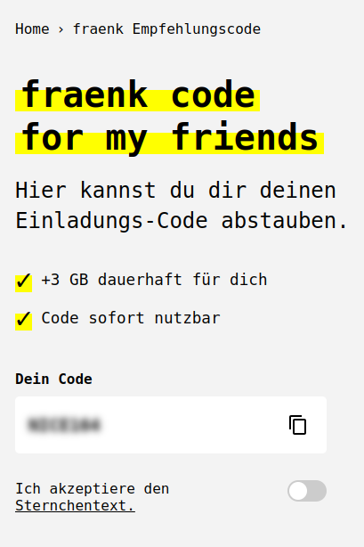

# fraenk for friends

A simple static website for the fraenk for friends referral program.

## Features

- Responsive design for mobile and desktop
- Code visibility toggle with terms acceptance
- Terms and conditions modal
- Copy code functionality

## Local Development

1. Clone the repository
2. Open `index.html` in your browser with: \
`google-chrome --disable-web-security --user-data-dir=/tmp/temporary-chrome-profile index.htm`
3. No build process required

## Deployment to Cloudflare Pages

1. Push your code to GitHub
2. Log in to Cloudflare Dashboard
3. Go to Pages > Create a project
4. Connect your GitHub repository
5. Configure your build settings:
   - Build command: Leave empty (no build required)
   - Build output directory: `/` (root directory)
6. Deploy

## File Structure

- `index.html` - Main HTML file
- `styles.css` - Styling
- `script.js` - JavaScript functionality
- `Teilnahmebedingungen.txt` - Terms and conditions text

## Browser Support

- Chrome (latest)
- Firefox (latest)
- Safari (latest)
- Edge (latest) 